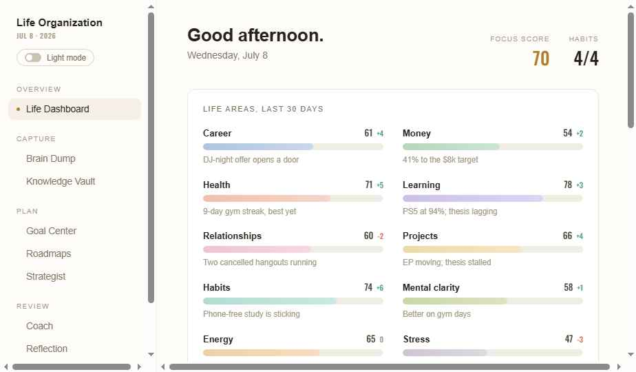

# Life Organization

A personal Life OS: capture unstructured thoughts, decompose goals into daily action, track projects, habits and life-area health, and reflect daily and weekly, with an engine woven invisibly through everything (classification, planning, coaching, pattern detection, review generation).

Built as a local-first desktop app: **Electron + React + TypeScript**, with a local **SQLite** database and a pluggable AI-provider layer. Implemented from the design handoff in [`design/`](design/README.md) (spec, prototype, and screenshots).



## Getting started

You need [Node.js](https://nodejs.org) 20 or newer (which includes `npm`). Then, from this folder:

```bash
npm install     # one time, downloads dependencies
npm start       # builds and opens the desktop app
```

That's it. The app opens on the Life Dashboard with sample data and works fully offline: every feature (brain-dump sorting, replanning, the coach, reflections, weekly review, patterns) runs against a built-in offline engine until you connect a real one.

### Connecting the real engine (optional)

1. Get an API key from [platform.claude.com](https://platform.claude.com) (Anthropic) or [platform.openai.com](https://platform.openai.com) (OpenAI, ChatGPT's maker). Note: these are developer API keys; a ChatGPT Plus or Claude subscription login cannot be used here.
2. In the app, open **Settings** (bottom of the sidebar).
3. Under **Engine**, choose **Anthropic API** or **OpenAI API** and paste your key.

The key is stored in the local database on your machine and is only ever sent to the matching API host (`api.anthropic.com` or `api.openai.com`). Default models are `claude-opus-4-8` and `gpt-5.1`; both are editable in the same screen.

### It learns your preferences over time

After every reflection and coach conversation, the engine quietly updates a short list of durable preferences it has learned about you (your best working hours, what late nights cost you, and so on), and folds that list into every plan, review, and reply it writes. The list lives in **Settings → What the engine has learned**, stays on your machine, and any item can be forgotten with one click. It works with the offline engine too, just more simply.

## Where your data lives

Everything is stored in a single SQLite file on your machine (no cloud, no accounts):

- **macOS**: `~/Library/Application Support/life-organization/life-org.db`
- **Windows**: `%APPDATA%/life-organization/life-org.db`
- **Linux**: `~/.config/life-organization/life-org.db`

Back that file up and you've backed up your life system.

In browser mode (the portable single-file build or `npm run dev`), data lives in the browser's local storage instead. Two protections are built in: **Settings → Your data → Keep a live data file** mirrors every change into a real on-disk JSON file that cookie wipes and cleanup tools (CCleaner and the like) can't touch, with automatic recovery if the browser's copy is ever cleared; and **Save a backup / Restore from backup** gives you portable snapshot files.

## The modules

| Module | What it does |
|---|---|
| **Life Dashboard** | Daily command center: focus score, life-area health (last 30 days), today's top tasks, schedule, goal progress, habits, active projects |
| **Brain Dump** | Write anything; the engine splits it into typed items (tasks, deadlines, people, ideas, …). Habit items propose new habits; everything is indexed into the Vault |
| **Knowledge Vault** | Everything you've ever written, searchable, plus "threads you've forgotten" connections |
| **Goal Center** | Each goal cascades Vision → 1-Year → Quarterly → Monthly → This week → Today; the roadmap regenerates from current progress, and every line is editable in place |
| **Roadmaps** | Project cards with milestone maps, dependencies, and risks |
| **Strategist** | Morning highest-impact actions and the evening debrief |
| **Coach** | A chat that knows everything you've written; persistent across sessions |
| **Reflection** | Five honest questions each evening; the engine reads them back to you |
| **Weekly Review** | Wins, failures, habits, time, progress, and recommended changes |
| **Patterns** | Behavioral patterns you haven't noticed, drawn from your own data |
| **Settings** | Engine provider and key, learned preferences, backup and restore, coach tone, top-task count, theme |

## Development

```bash
npm run dev        # renderer only, in your browser at localhost:5173
npm run dev:app    # renderer + Electron with live reload
npm run typecheck  # TypeScript checks for renderer and main process
npm run build      # production build (dist/ + dist-electron/)
npm run dist       # package installers (dmg/exe/AppImage) via electron-builder
```

In browser mode (`npm run dev`) data persists to `localStorage` instead of SQLite, and Anthropic API calls go directly from the browser; the Electron app keeps the key in the main process.

### Architecture

```
electron/           main process
  main.ts           window + IPC + Anthropic proxy (key never enters the renderer)
  db.ts             SQLite schema + persistence (node:sqlite, no native deps)
  preload.ts        the window.lifeOS bridge
src/
  lib/
    types.ts        all data shapes
    store.tsx       app state + every action (data + AI), one React context
    backend.ts      storage/network boundary: Electron IPC or browser fallback
    ai/provider.ts  AIProvider interface: StubProvider (offline), AnthropicProvider, OpenAIProvider
    ai/prompts.ts   buildContext() + the exact prompt contracts from the design
    scores.ts       area-score model + focus score
  components/ui.tsx shared primitives (Card, Track, Chip, …)
  modules/          one file per screen
design/             the original design handoff (spec, prototype, screenshots)
```

Every module is its own component behind a clean data layer, so features can be added or swapped without rewrites. The AI layer degrades gracefully: any failure shows a quiet toast ("Couldn't reach the engine, try again in a moment") and never loses data.
