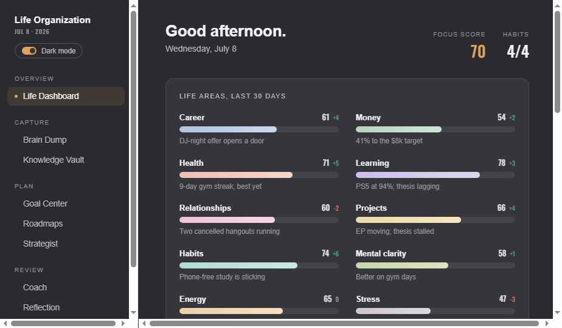
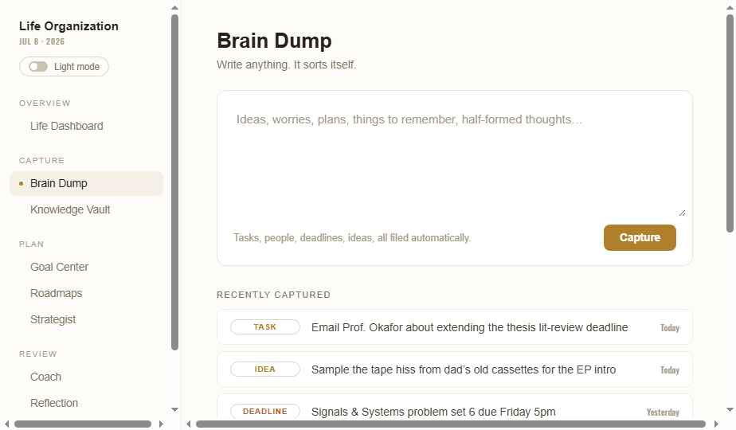
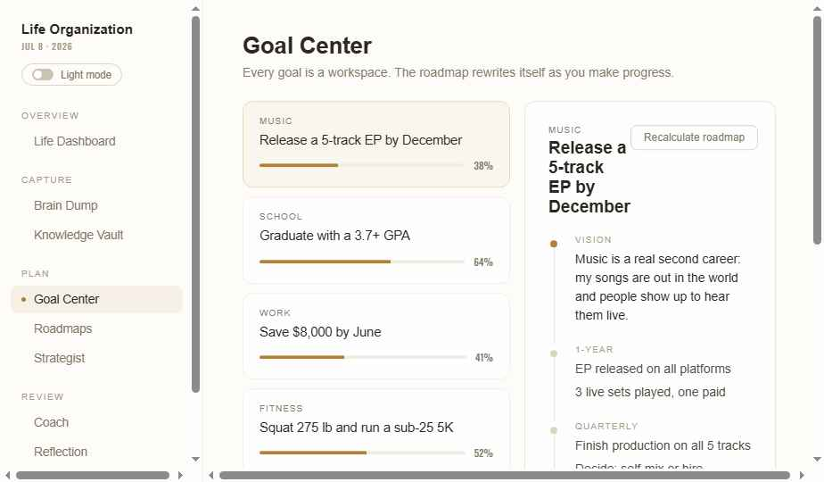
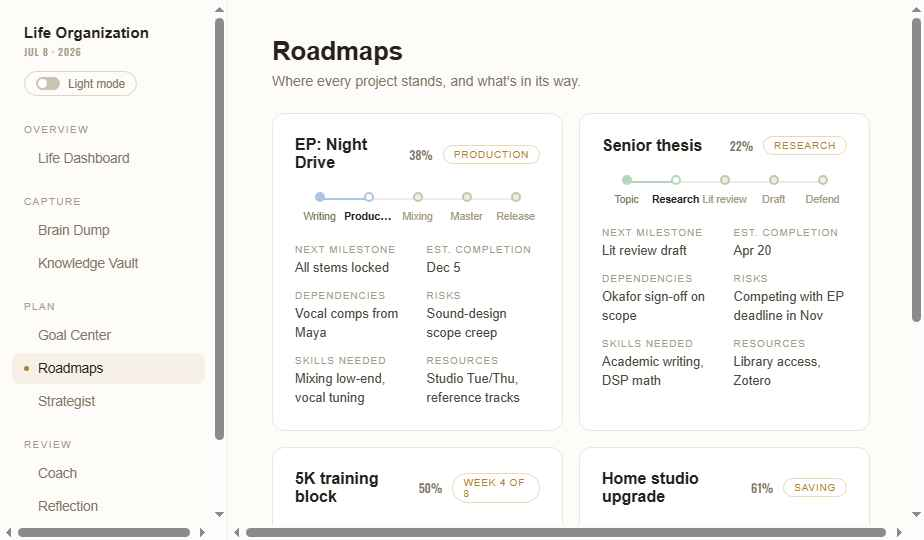
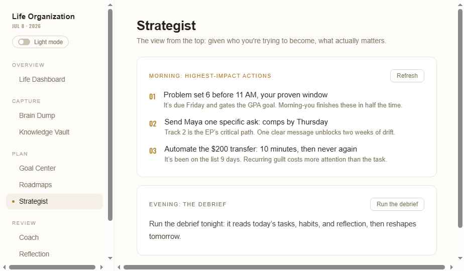
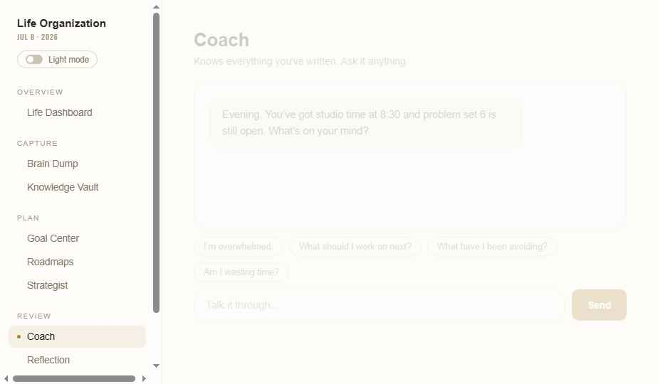
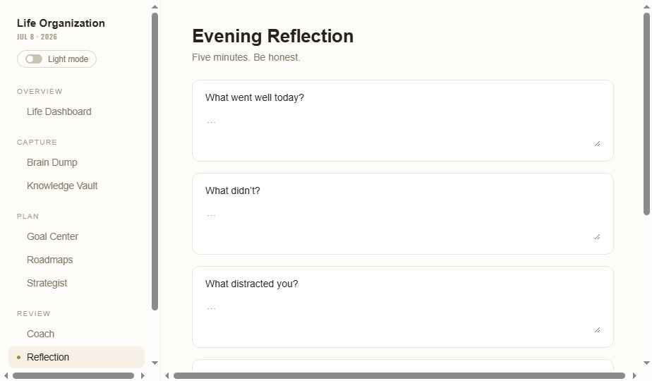
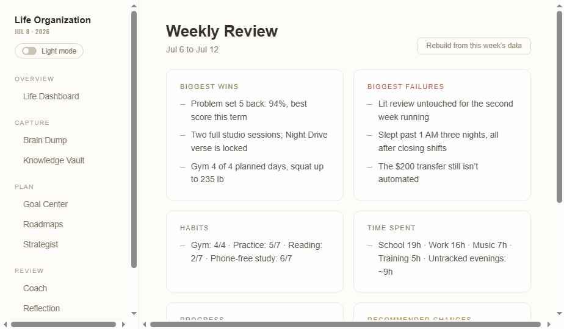
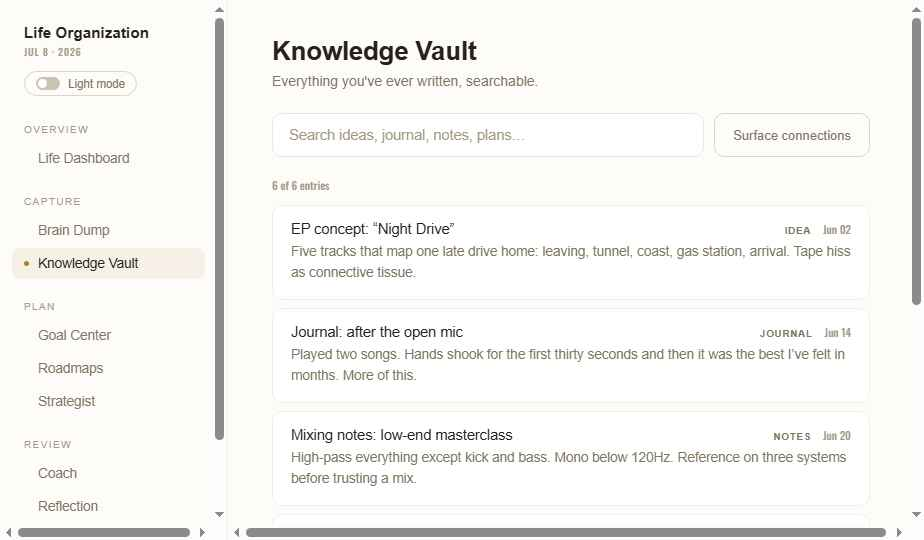
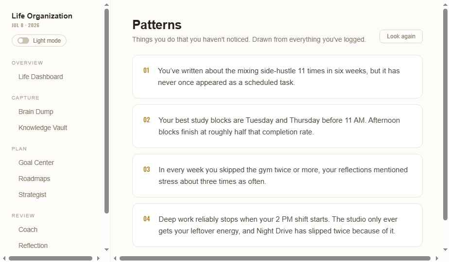

# Handoff: Life Organization — Personal Life OS

## Overview
A single-user desktop application for organizing an entire life: capturing unstructured thoughts, decomposing goals into daily action, tracking projects, habits and life-area health, and reflecting daily/weekly — with an AI engine woven invisibly through everything (classification, planning, coaching, pattern detection, review generation). Built for one specific user whose life areas are Music, School, Work, and Fitness.

## How to use this package (read first)
1. Read this README top to bottom before writing code.
2. Open `screenshots/` for the visual reference of every screen (light + dark).
3. Open `Life Organization.dc.html` and read the `Component` logic class at the bottom of the file — it contains the exact AI prompt strings, JSON parsing, seed data shapes, and theme palettes. Treat it as the behavioral spec.
4. Build in this order: app shell + theme system → data layer (SQLite schema below) → Life Dashboard → Brain Dump → Goal Center → Roadmaps → Coach → Reflection → Weekly Review → Vault → Patterns → Strategist → Settings.
5. Every AI feature must work with the `AIProvider` interface stubbed (return canned text) so the app is fully usable before an API key is added.

## About the Design Files
The files in this bundle are **design references created in HTML** — a working prototype showing intended look and behavior, not production code to copy directly. Your task is to **recreate this design as a real local desktop application** (the user's stated target: a local desktop app they can connect to an AI provider). Recommended stack if none exists yet: **Tauri or Electron + React + TypeScript**, with a local SQLite database and a pluggable AI-provider layer (Anthropic API first). Use the prototype's `Life Organization.dc.html` as the visual and behavioral source of truth.

**Leave the architecture open**: every module below should be its own component/route with a clean data layer between UI and storage, so features can be added or swapped without rewrites.

## Fidelity
**High-fidelity.** Colors, typography, spacing, and layouts are final and should be recreated closely. The AI features in the prototype are live and demonstrate the exact intended prompt/response behavior.

## Core Architecture Requirements (make it real)
1. **Local-first storage.** All user data in a local DB (SQLite). Prototype uses `localStorage` keys `life-org-v2` (dump items, habits, top tasks, chat) and `life-org-theme` — replace with proper tables: `entries` (brain dump), `goals`, `goal_levels`, `projects`, `milestones`, `habits`, `habit_logs`, `tasks`, `reflections`, `weekly_reviews`, `patterns`, `vault_notes`, `chat_messages`, `area_scores`.
2. **Pluggable AI provider.** The prototype calls `window.claude.complete(promptOrObject)` — either a plain prompt string or `{system, messages}`. Wrap this in an `AIProvider` interface (`complete(system, messages) => string`) so the user can plug in Anthropic (recommended: Messages API), or any other provider, via a settings screen with an API key field. All AI calls must fail gracefully (see Error States).
3. **Context assembly.** Every AI call is prefixed with a serialized snapshot of the user's data (goals + progress, today's tasks, habits + streaks, recent brain-dump items, observed patterns). See "AI Prompt Contracts" below — keep this as a single `buildContext()` function reading from the DB.
4. **No AI branding in UI.** Results just appear. Never label anything "AI". The tone is a sharp, warm, plainspoken coach. Never use em dashes in generated text (post-process: replace em/en dashes as the prototype's `clean()` does). Times always 12-hour AM/PM.

## Screenshots
All referenced images live in `screenshots/`. They are captures of the running prototype and are the ground truth for layout, spacing, and color.

| File | Screen |
|---|---|
| `01-life-dashboard-light.png` | Life Dashboard, light theme (default view) |
| `02-life-dashboard-dark.png` | Life Dashboard, dark theme |
| `03-brain-dump.png` | Brain Dump |
| `04-goal-center.png` | Goal Center with cascade |
| `05-roadmaps.png` | Roadmaps with pastel milestone maps |
| `06-strategist.png` | Strategist morning/evening |
| `07-coach.png` | Coach chat |
| `08-reflection.png` | Evening Reflection |
| `09-weekly-review.png` | Weekly Review |
| `10-knowledge-vault.png` | Knowledge Vault |
| `11-patterns.png` | Patterns |

## Screens / Views

Global shell: fixed left sidebar (228px) + scrollable main content (max-width 1060px, padding 36px 44px 80px). Active module rendered in main.

### 1. Sidebar Navigation
- App title "Life Organization" (15px, 600) + date in Oswald 10px uppercase + theme toggle pill (mini switch, 24×13px track, animated knob, label "Light mode"/"Dark mode").
- Groups (11px/10px Helvetica 500 uppercase letterspaced headers): **Overview** → Life Dashboard; **Capture** → Brain Dump, Knowledge Vault; **Plan** → Goal Center, Roadmaps, Strategist; **Review** → Coach, Reflection, Weekly Review, Patterns.
- Item: 13.5px Helvetica 500, 8px/12px padding, radius 8px; active = accent-tinted bg + accent 5px dot; hover = hover-tint bg.
- Default module on launch: **Life Dashboard**.

### 2. Life Dashboard (default view; also the daily command center)

- Header: greeting by time of day ("Good morning." etc., 26px Helvetica 600) + full date; right side: Focus score (Oswald 26px accent) and Habits done "n/total".
- **Life areas card** (full width): "LIFE AREAS, LAST 30 DAYS" label; 2-column grid of 10 areas (Career, Money, Health, Learning, Relationships, Projects, Habits, Mental clarity, Energy, Stress). Each row: name (13px 600) + score (Oswald 13px) + trend (+n green #4FA372 / −n #D9705F / 0 faint); 10px-tall rounded track with pastel gradient fill at score%; one-line note in faint 11.5px, ellipsized. Pastel palette (fill gradients, left→right): powder blue #AFC4E0→#C9D8EC, pastel green #B4D6BC→#CDE5D3, peach #F0BFB0→#F7D6CB, lavender #CDBFE6→#DFD5F0, blush #EFC3D3→#F6D8E3, butter #EFD9A8→#F6E6C3, mint #B2DCD3→#CBE9E2, pistachio #C9D6A8→#DBE4C2, apricot #F0CFA6→#F6DFC1, grey-lilac #CFC5D2→#DFD8E1. **Real implementation**: compute scores from activity + reflections (completion rates, streaks, sentiment), not hardcoded.
- Two-column grid (1.7fr / 1fr):
  - Left: **"{n} things that matter today"** card — numbered task rows (raised bg, radius 9px, 13px/16px padding): Oswald accent number, task text 14.5px (strikethrough + faded when done), uppercase area chip, checkbox (18px, accent fill + ✓ when checked). "Replan" button asks the AI to pick the n highest-impact tasks. **"Today's schedule"** card — time (Oswald 12px, 12-hour), label, uppercase area tag; back with a real calendar table (and optionally OS calendar integration later). **"Progress toward goals"** card — goal title + % + 5px accent progress bar.
  - Right: **Habits** card — checkbox rows with streak "nd" in Oswald; toggling updates streaks in DB. **Active projects** card — name, stage, thin bar (bar2 color).
- Focus score formula in prototype: `min(99, 42 + doneTasks*14 + habitsDone*7)` — replace with a smarter daily metric if desired.

### 3. Brain Dump

- Title + subtitle "Write anything. It sorts itself."
- Large textarea (min 150px) in a card; status line; accent "Capture" button (busy state "Sorting…").
- On capture: AI splits the text into atomic items typed as Task / Project / Goal / Person / Deadline / Habit / Problem / Opportunity / Decision / Idea / Note (JSON array contract below); items prepend to "Recently captured" list.
- List row: 88px-wide uppercase type chip (per-type color, see tokens), item text, relative time in Oswald. **Real implementation**: tasks flow into the task store; deadlines create dated items; habits propose new habit entries.

### 4. Goal Center

- Left column (300px): goal cards — area label (10px uppercase), title (14.5px 500), thin accent progress bar + %. Selected card = raised bg + stronger border.
- Right: cascade panel for the selected goal — vertical timeline Vision → 1-Year → Quarterly → Monthly → This week → Today (dot + connecting line; first/last dots accent). Level label 10px uppercase faint; items 14px (Today items in accent). "Recalculate roadmap" button regenerates the whole cascade from current progress via AI (JSON contract below). **Real implementation**: cascade levels editable inline; progress % derived from completed cascade items.

### 5. Roadmaps

- 2-column grid of project cards. Card: name (16px 600) + % (Oswald) + stage pill (Helvetica 10px uppercase, accent text, accent-border outline).
- **Milestone map**: horizontal stepper — one dot per phase, connected by 2px lines; completed/current use the project's pastel color (synced to life-area palette), upcoming neutral; current label 600 dark, past muted, future faint. Phases per project, e.g. Writing→Production→Mixing→Master→Release.
- Fields grid (2-col): Next milestone, Est. completion, Dependencies, Risks, Skills needed, Resources — 10px uppercase key + 13px value. **Real implementation**: projects CRUD; AI can draft/update fields and advance stages.

### 6. Strategist

- Max-width 720px. **Morning card**: "MORNING: HIGHEST-IMPACT ACTIONS" (accent label) + Refresh button; 3 numbered items — action (15px 500) + why (13px muted). **Evening card**: "EVENING: THE DEBRIEF" + "Run the debrief" button; paragraph output. Both AI-generated (contracts below). **Real implementation**: schedule morning generation on first open of the day; evening after 6 PM or on demand.

### 7. Coach (chat)

- Full-height column: scrollable message list (user bubbles right, accent-tint bg; assistant left, raised bg; 14.5px, radius 12px, max-width 78%), "thinking…" blink indicator, suggestion chips ("I'm overwhelmed.", "What should I work on next?", "What have I been avoiding?", "Am I wasting time?"), input + accent Send (Enter submits).
- Conversation persists across sessions. The system prompt includes the full context snapshot + tone instruction. **Real implementation**: keep full history in DB; consider summarizing old turns into the context.

### 8. Reflection

- Max-width 720px; five question cards, each with an inline textarea: What went well today? / What didn't? / What distracted you? / Did today's work move you toward your goals? / What should tomorrow focus on?
- "Close out the day" → AI returns under-100-word response: one honest observation, one thing to protect tomorrow, one thing to drop. Output card: raised bg, accent-border, "TONIGHT'S READ" accent label. **Real implementation**: store reflections by date; feed into weekly review + pattern detection + area scores.

### 9. Weekly Review

- Header with week range ("Jul 6 to Jul 12") + "Rebuild from this week's data" button.
- 2-col grid of six cards: Biggest wins (green header #4FA372-family), Biggest failures (red family), Habits, Time spent, Progress, Recommended changes (accent header). Dash-bulleted items. AI-generated from the week's data (contract below).

### 10. Knowledge Vault

- Search input (live filter over title+snippet+tag) + "Surface connections" button → AI finds 2-3 forgotten threads between notes and goals; output in accent-bordered card "THREADS YOU'VE FORGOTTEN".
- Count line (Oswald 11px), then note cards: title (14.5px 500), uppercase tag + date (Oswald), 2-line snippet (13.5px muted). **Real implementation**: every brain-dump item, journal entry, reflection and note is indexed here; consider embeddings for semantic search later (leave the search interface pluggable).

### 11. Patterns

- Header + "Look again" button. Numbered cards (Oswald accent "01"–"04") each holding one observation sentence (15px, 1.6 line-height). AI acts as objective observer: specific, slightly uncomfortable, evidence-flavored (counts, days, times). **Real implementation**: run over real logs (task completions by hour/day, habit lapses vs. stress mentions, repeated-but-unscheduled themes).

## Interactions & Behavior
- Module switch: instant, with 0.3s `fadeUp` entrance (translateY 6px → 0, fade in).
- All buttons: pointer cursor; ghost buttons gain accent border + full text color on hover; accent buttons lighten to accent-hover.
- Checkboxes toggle instantly and persist.
- Every AI action has a busy label ("Sorting…", "Replanning…", "Recalculating…", "Thinking…", "Compiling…", "Tracing…", "Reviewing…", "Looking…") and disables re-trigger while busy.
- Errors: fixed bottom-right toast, 4s auto-dismiss: "Couldn't reach the engine, try again in a moment." (err tokens below).
- Theme toggle animates knob (0.15s), persists, applies instantly via CSS variables on `:root`.
- Chat auto-scrolls to bottom on new messages.

## State Management
- `module` (active view), per-module busy flags, `dark` theme flag.
- Data stores: dumpItems, goals (with 6-level cascade + progress), top tasks (text/area/done), schedule, habits (name/streak/done), projects (stage/%/map/fields), patterns, weekly review sections, vault notes, chat history, reflection answers + output, morning actions + evening text, area scores.
- Persist everything; hydrate on launch.

## AI Prompt Contracts (implement exactly; all JSON responses parsed leniently — strip code fences, find first `[`/`{`)
Context preamble for every call: persona description + goals w/ progress + this week's items + today's tasks + habits w/ streaks + last 10 dump items + current patterns + "Never use an em dash" + 12-hour time instruction. Tone setting (user-configurable: direct / supportive / analytical) appended for coach, reflection, evening.
1. **Brain dump**: classify into types listed above → `[{"type":"Task","text":"..."}]`, each <120 chars, first person preserved.
2. **Replan top-n**: pick n highest-impact tasks given schedule → `[{"text":"...","area":"Music|School|Work|Fitness"}]`, <70 chars each.
3. **Goal cascade**: rebuild roadmap for goal at current % → `{"vision":"...","year":[...],"quarter":[...],"month":[...],"week":[...],"today":[...]}`, items <90 chars.
4. **Patterns**: 4 unnoticed behavioral patterns, evidence-flavored → JSON array of 4 strings <180 chars.
5. **Reflection**: given 5 Q&A pairs → plain text <100 words: one observation, one thing to protect, one thing to drop.
6. **Weekly**: → `{"wins":[3],"fails":[3],"habits":[1],"time":[1],"progress":[1],"changes":[3]}`, items <110 chars.
7. **Vault connections**: given all notes → 2-3 bullet lines (•), <90 words total.
8. **Strategist morning**: 3 highest-impact actions today → `[{"action":"<70 chars","why":"<120 chars"}]`.
9. **Strategist evening**: given completed tasks → plain text <110 words: what moved goals, what slowed, how tomorrow changes.
10. **Coach**: system = context + tone + "keep replies under 120 words"; messages = full chat history.

## Design Tokens

### Typography
- **Body / UI text**: SF Pro stack `-apple-system, BlinkMacSystemFont, 'SF Pro Text', 'SF Pro Display', 'Helvetica Neue', sans-serif`, base weight **500** (Apple-OS feel), antialiased.
- **Section titles & headers**: `'Helvetica Neue', Helvetica, Arial, sans-serif`; page titles 26px/600/−0.01em; card labels 10–11px/500/uppercase/0.12em tracking.
- **All numbers** (scores, %, streaks, times, dates, list numerals): **Oswald** 500 (FIFA-rating style condensed), fallback `'Arial Narrow', sans-serif`. Google Fonts import: Oswald 400/500/600.
- Sizes: page title 26px, card titles 16px, body 14–15px, secondary 13–13.5px, captions 11–12.5px, chips 10–10.5px uppercase, big stats 26px, focus-timer-style numerals n/a.

### Colors — Light theme (default)
`--bg:#FDFCF9; --card:#FFFFFF; --raised:#F8F6EF; --line:#F1EFE7; --border:#E9E6DB; --chip:#DBD6C6; --box:#C9C3B0; --accent-border:#E9D9B4; --track:#F0EEE4; --faint:#A39A87; --muted:#7E7663; --text2:#4C463A; --text:#26221A; --accent:#B07F2C; --accent-hover:#C79A4D; --on-accent:#FFFDF6; --hover-tint:rgba(176,127,44,0.06); --active-tint:rgba(176,127,44,0.09); --bubble-tint:rgba(176,127,44,0.09); --bar2:#B5A87F; --dot-idle:#D9D3C1; --good:#6E7F3F; --bad:#B0563F; --mid:#8A7A5A; --tag-project:#A5691F; --tag-deadline:#B05E33; --tag-idea:#A5852B; --tag-decision:#8A66A8; --tag-note:#82755C; --err-bg:#FAEFE4; --err-border:#D9A98C; --err-text:#A0522E;`

### Colors — Dark theme (grey charcoal, not brown)
`--bg:#2B2B2F; --card:#35353B; --raised:#3F3F46; --line:#3C3C43; --border:#4A4A52; --chip:#585862; --box:#686873; --accent-border:#766340; --track:#44444D; --faint:#98989F; --muted:#BCBCC3; --text2:#E2E2E6; --text:#F4F4F6; --accent:#E0A458; --accent-hover:#EDC088; --on-accent:#1F1F22; --hover-tint:rgba(224,164,88,0.08); --active-tint:rgba(224,164,88,0.12); --bubble-tint:rgba(224,164,88,0.14); --bar2:#9C9C8A; --dot-idle:#5E5E69; --good:#AEBB88; --bad:#D18A7A; --mid:#C2C2B4; --tag-project:#D0955C; --tag-deadline:#D8967A; --tag-idea:#DCBE78; --tag-decision:#C2A6D4; --tag-note:#A8A89E; --err-bg:#3A2A24; --err-border:#7A5342; --err-text:#E0AC98;`

- Trend green #4FA372, trend red #D9705F (both themes). Pastel area/roadmap palette listed under Life Dashboard.
- Brain-dump type chip colors: Task/Goal = accent; Project = tag-project; Person = mid; Deadline = tag-deadline; Habit = good; Problem = bad; Opportunity/Idea = tag-idea; Decision = tag-decision; Note = tag-note.

### Spacing & shape
- Card: radius 12px, 1px border (--border), padding 20–26px; inner rows radius 9–11px.
- Grid gaps 14–16px; sidebar 228px; content max 1060px.
- Pills/chips: radius 20px. Buttons: radius 7–10px, padding 9–13px vertical equivalents.
- Progress tracks 4–10px tall, radius = half height.
- Scrollbars: 10px, thumb --chip-ish rounded.

### Writing rules (enforce in UI copy and AI output)
- **Never use em dashes** anywhere. Use commas, colons, or periods.
- 12-hour AM/PM times only.
- No emoji. No "AI" labels.

## Error / Loading States
- AI failure → toast (see above), busy flag cleared, prior data untouched.
- All AI JSON parsed defensively; on parse failure treat as error toast, never crash.
- Empty states: keep cards rendered with their headers; show quiet faint-text placeholders.

## Assets
- No image assets. Fonts: Oswald via Google Fonts (bundle locally in the real app); SF Pro via system; Helvetica Neue via system.

## Files
- `README.md` — this spec. Self-sufficient; implement from it plus the screenshots.
- `screenshots/` — 11 captures of every screen (see table above).
- `Life Organization.dc.html` — the full prototype (single file: markup with inline styles + a `Component` logic class at the bottom containing all state, AI calls, prompt strings, theme palettes, and seed data). Read the logic class for exact prompt wording and data shapes.
- `support.js` — prototype runtime only; **ignore for implementation**.

## Acceptance checklist (definition of done)
- [ ] App launches to Life Dashboard in light theme; theme toggle switches and persists.
- [ ] All 10 sidebar modules render and match their screenshot.
- [ ] Brain dump capture classifies text into typed items and persists them.
- [ ] Tasks and habits toggle, persist, and update Focus score.
- [ ] Goal cascade regenerates via AI and renders all 6 levels.
- [ ] Coach chat holds a persistent multi-turn conversation with full user context.
- [ ] Reflection, Weekly Review, Patterns, Vault connections, and both Strategist actions each produce AI output per their contract.
- [ ] Every AI call has a busy state and a graceful error toast; the app never crashes on a bad AI response.
- [ ] No em dashes anywhere in UI copy or AI output; all times 12-hour AM/PM; no emoji; no "AI" labels.

## Open items intentionally left to the implementer
- Real calendar source for Today's schedule (manual entries first; OS calendar later).
- Area-score computation model (define signals; start simple: task completion + habit adherence + reflection sentiment).
- Focus timer / focus mode was removed from the design by request; the schema needn't reserve it.
- Notifications (evening reflection prompt, morning strategist) — desktable via OS notifications.
- Settings screen: AI provider + API key, coach tone (direct/supportive/analytical), top-task count (1–5), theme.
